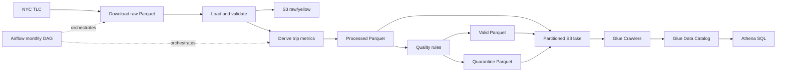

# NYC Taxi Cloud Lakehouse

A monthly data pipeline for NYC TLC Yellow Taxi trips, built with Python, PyArrow and AWS. It preserves raw data, derives trip metrics and separates anomalous records from data suitable for analysis.

The technical objective is a reproducible ingestion-to-query workflow. The analytical objective is to make trip duration, distance and speed available in partitioned Parquet datasets, while retaining rejected records for investigation.

## Architecture



Athena is the query layer over the Glue catalog; the Python pipeline does not execute Athena queries. The raw upload is separate from the three crawlers for processed, valid and quarantine data.

## Stack and repository

Python 3.12, PyArrow, Requests, boto3/botocore, Amazon S3, AWS Glue, Athena, Apache Airflow 3, pytest and GitHub Actions. Pandas is present in the pinned data environment, but application modules use PyArrow directly. Airflow uses `python-dateutil` for calendar month arithmetic and runs in a separate environment.

```text
nyc-taxi-cloud-lakehouse/
├── ingestion/           # Download, load and validate raw data
├── transformation/      # Derived metrics, quality split, local outputs
├── cloud/               # S3 uploads/existence checks and Glue triggers
├── config/cloud.py      # AWS resource names and region
├── orchestration/monthly.py  # Monthly CLI and backfill function
├── dags/nyc_taxi_monthly.py   # Airflow DAG
├── tests/               # Local deterministic tests
├── data/                # Local raw/processed/valid/quarantine files (ignored)
├── requirements.txt     # Data pipeline and test dependencies
└── Dockerfile           # Python 3.12 pipeline image
```

This project lives inside the `data-engineering-labs` repository. Its active CI workflow is at `../.github/workflows/nyc-taxi-ci.yml`, relative to this directory.

## Pipeline and data quality

1. Download the selected monthly Yellow Taxi Parquet file in chunks. An existing local raw file is reused; failed downloads remove partial output.
2. Load the raw file into a PyArrow table and validate it. Empty tables, missing required columns and null pickup/dropoff timestamps stop the pipeline.
3. Upload raw data to S3 if its key does not exist.
4. Reload and validate raw data in the independently executable transformation pipeline. Add `trip_duration_minutes` and `avg_speed_mph`; nonpositive durations yield a null speed.
5. Save the complete processed dataset, then split and save valid/quarantine datasets using Snappy-compressed Parquet.
6. Upload missing output objects and start the three configured Glue crawlers if any transformed output was uploaded.

The transformation logs retain `Step 1/6` through `Step 6/6`, followed by upload and crawler logs. Downloads, row counts, blocking validation failures and quality split counts are also logged.

| Rule | Result |
| --- | --- |
| Duration <= 0 | Quarantine: `INVALID_DURATION` |
| Distance < 0 | Quarantine: `NEGATIVE_DISTANCE` |
| Average speed > 100 mph | Quarantine: `EXCESSIVE_SPEED` |
| No rule matched | Valid |

Validation warns about these anomalies rather than dropping rows. The processed dataset retains all rows; valid plus quarantine preserves the original row count. A quarantined row receives one `quarantine_reason`, with precedence duration, distance, then speed. Null distances are not explicitly rejected by the current rules.

## S3, Glue and Athena

All keys use the source file's year/month, rather than individual trip timestamps:

```text
s3://<bucket>/
├── raw/yellow/year=2026/month=08/yellow_tripdata_2026-08.parquet
├── processed/year=2026/month=08/yellow_tripdata_2026-08.parquet
├── quality/valid/year=2026/month=08/yellow_tripdata_2026-08.parquet
└── quality/quarantine/year=2026/month=08/yellow_tripdata_2026-08.parquet
```

S3 existence checks use `head_object`. Existing keys are skipped, so repeated runs avoid reuploading them. Local transformation outputs are still recomputed. This is existence-based idempotence: there is no checksum comparison or automatic replacement of outdated objects.

If any processed/quality object is newly uploaded, all three crawlers are triggered. Already-running crawlers are safely skipped. The pipeline starts crawlers asynchronously; completion and catalog availability must be checked before querying Athena.

Configure each crawler with its matching S3 prefix and a Glue database. In Athena, select that database and query the crawler-created valid table. For example, adapt the table name and partition types to your catalog:

```sql
SELECT year, month, COUNT(*) AS trip_count,
       AVG(trip_duration_minutes) AS avg_duration_minutes
FROM your_valid_table
WHERE year = '2026' AND month = '08'
GROUP BY year, month;
```

Multipart transfers use an **8 MiB threshold**, **8 MiB chunks** and **four concurrent transfers**. A previously measured local benchmark for approximately 95 MB went from about 145 seconds at concurrency 1 to 16 seconds at concurrency 4. These are environment-specific observations, not throughput guarantees. This tuning addressed the observed slow uploads and Airflow heartbeat timeout.

## Installation and configuration

Run commands from this project directory. The established setup separates the pipeline/test environment (`data_engineering`) from the scheduler environment (`airflow_env`).

```bash
source "$HOME/environments/data_engineering/bin/activate"
python --version  # Python 3.12
python -m pip install -r requirements.txt
```

For a fresh local setup, create a Python 3.12 virtual environment and install the same requirements. For Airflow, use the separate `airflow_env` with Airflow 3 and `python-dateutil`; the validated local scheduler version is Airflow 3.0.6. Airflow is deliberately absent from the data pipeline requirements.

`config/cloud.py` reads these environment variables, with existing project defaults:

| Variable | Purpose |
| --- | --- |
| `S3_BUCKET_NAME` | Destination bucket |
| `AWS_REGION` | S3 and Glue region |
| `GLUE_PROCESSED_CRAWLER_NAME` | Processed crawler |
| `GLUE_VALID_CRAWLER_NAME` | Valid crawler |
| `GLUE_QUARANTINE_CRAWLER_NAME` | Quarantine crawler |

Set these variables to your own resources before running the pipeline. Authentication uses boto3's normal AWS credential chain; no credentials are embedded in the source. A `.env` file is not automatically loaded. Provision the bucket, crawler targets, Glue database and required AWS permissions separately. Athena also requires a query results location and query permissions. Infrastructure provisioning is outside this repository's implementation.

## Run a month manually

From `data_engineering`, with AWS access configured:

```bash
python -m orchestration.monthly --year 2026 --month 8
```

This command downloads data and performs real S3/Glue operations. Years before 2009 and months outside 1–12 are rejected by ingestion. The CLI returns **75** for source HTTP **403/404**; other errors propagate as failures.

An optional same-year backfill is available through `run_backfill(year, start_month, end_month)` in `orchestration.monthly`. Its current behavior skips all HTTP errors, unlike the single-month CLI's special handling of 403/404.

## Airflow orchestration

The `nyc_taxi_monthly` DAG runs at `0 6 5 * *` (06:00 on the fifth day of each month, in the configured Airflow timezone), with `catchup=False`.

- Manual `dag_run.conf` containing both `year` and `month` takes precedence; values are converted to integers.
- Otherwise, the target is `logical_date - SOURCE_LAG_MONTHS`, with a two-calendar-month lag. A partial override falls back to the logical date.
- Exit code 75 raises an Airflow retry exception for the first three attempts. Retries are six hours apart; the fourth unsuccessful attempt becomes `SKIPPED`.
- Other subprocess errors follow normal Airflow failure/retry handling and ultimately become `FAILED`, rather than `SKIPPED`.

From `airflow_env`:

```bash
source "$HOME/environments/airflow_env/bin/activate"
export AIRFLOW__CORE__DAGS_FOLDER="$PWD/dags"
airflow standalone
```

In a second terminal, activate the same environment and set the same DAG folder:

```bash
airflow dags list-import-errors
airflow dags list
airflow dags trigger nyc_taxi_monthly --conf '{"year": 2026, "month": 8}'
```

The DAG currently contains personal absolute `PROJECT_ROOT` and `PROJECT_PYTHON` paths. They are preserved for the existing setup; another machine must adapt them before use. The subprocess runs the pipeline through `data_engineering`, while Airflow itself stays in `airflow_env`. Standalone is the local development launcher.

## Tests and CI

Run tests from `data_engineering`:

```bash
source "$HOME/environments/data_engineering/bin/activate"
python -m pytest -q
git diff --check
git status --short
```

Tests cover raw loading, blocking validation, derived metrics, quality routing, row preservation, local writes, S3 errors/idempotence, Glue triggers, filename year/month parsing and monthly orchestration. CLI tests exercise exit code 75 and propagated errors. DAG unit tests simulate Airflow interfaces to check manual/fallback month selection and retry/skip branches without a scheduler or network calls; they complement real Airflow integration validation.

The active GitHub Actions workflow installs dependencies and runs pytest on Python 3.12, then builds the Docker image. It filters changes to this project and its root workflow. The Dockerfile's default command transforms the fixed January 2026 raw file; raw data is excluded from the image and must be mounted. Override the command for a monthly CLI run.

## Current limits and reasonable next steps

- Monthly files are processed in memory; large backfills may require batch processing.
- Existing S3 keys are not refreshed after rule changes. Concurrent runs are not protected by a distributed lock.
- A crawler failure after uploads can leave catalog updates pending: a rerun with no new output will not retrigger crawlers.
- Timestamp arithmetic assumes microsecond-resolution source timestamps; there is no generalized schema evolution policy.
- Quality rules do not yet cover null distances, fare anomalies or all domain fields.
- The project has no infrastructure-as-code deployment, automatic Athena queries or centralized metrics/alerts.

Reasonable future work includes portable DAG configuration, explicit timestamp/schema checks, richer quality summaries, a catalog reconciliation command and versioned infrastructure provisioning. These can be added when needed without changing the current monthly flow.

## What this project demonstrates

- Modular Python ingestion and vectorized PyArrow transformations.
- Explicit blocking validation and auditable anomaly quarantine.
- Partitioned Parquet storage and existence-based upload idempotence.
- S3 transfer tuning and AWS Glue catalog integration for Athena analysis.
- Airflow scheduling, manual parameters and bounded source-availability retries.
- Deterministic tests, separation of environments and CI validation.
